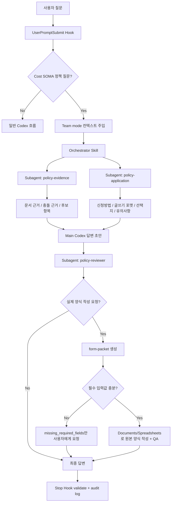

# Cost SOMA Harness Workflow

## Runtime Roles

### Hooks

Hooks are runtime guardrails.

- `UserPromptSubmit`: detects Cost SOMA-like policy turns and injects always-team-mode context.
- `Stop`: validates policy-like final answers with `policy_tool.py validate` and writes an audit log.

Hooks route and audit. They do not make the final policy decision.

### Skills

The harness uses function-split skills.

- `cost-soma-policy-orchestrator`: owns the whole answer flow, subagent order, final Korean answer shape, and form-file boundary.
- `cost-soma-evidence`: collects document-backed candidates, supporting evidence, conflicting evidence, and source references.
- `cost-soma-application`: prepares 신청방법, 글쓰기 포맷, choice-required fields, draftable fields, 유의사항, and form-packet summaries.
- `cost-soma-answer-review`: reviews the draft for missing sections, weak evidence, unsafe certainty, and category-specific omissions.

### Subagents

For every detected Cost SOMA policy question, the injected context tells Codex to use team mode.

- Spawn `policy-evidence` and `policy-application` in parallel.
- Wait for both summaries.
- Draft the answer in the main Codex session.
- Spawn `policy-reviewer`.
- Revise and finalize from the reviewer findings.

`policy-evidence` keeps `model = "gpt-5.5"` and `model_reasoning_effort = "high"`. Other subagents inherit the parent session unless the local agent file says otherwise.

### Scripts

The script engine is the only policy runtime.

```bash
python3 scripts/policy_tool.py classify --question "$QUESTION"
python3 scripts/policy_tool.py search --query "$QUERY" --category "$CATEGORY"
python3 scripts/policy_tool.py docs --category "$CATEGORY"
python3 scripts/policy_tool.py form --question "$QUESTION"
python3 scripts/policy_tool.py templates --category "$CATEGORY" --stage "$STAGE"
python3 scripts/policy_tool.py form-packet --question "$QUESTION" --category "$CATEGORY" --stage "$STAGE" --payment-method "$PAYMENT_METHOD" --known-values-file known-values.json
python3 scripts/policy_tool.py validate-artifacts --form-packet-file form_packet.json --artifact outputs/cost-soma-forms/<timestamp>/<file>
python3 scripts/policy_tool.py validate --question "$QUESTION" --answer-file "$DRAFT_FILE"
```

All script output is JSON only. Document truth comes only from `document/rules.json` and `document/*.md`.

## End-To-End Flow



## Form Artifact Boundary

When the user asks for a real submit-ready form file:

- `policy_tool.py form-packet` returns `templates`, `draft_values`, `choice_fields`, `missing_required_fields`, `manual_steps`, `remaining_submission_requirements`, `artifact_instructions`, and `ready_to_generate`.
- Codex asks only for `missing_required_fields` before generating final artifacts.
- `.docx` artifacts are created from the original file with the Documents skill and rendered for visual QA.
- `.xlsx` artifacts are created from the original file with the Spreadsheets skill and inspected/rendered for QA.
- Files are saved under `outputs/cost-soma-forms/<timestamp>/`.
- Uploading to external systems is out of scope.
- Signatures, resident registration numbers, ID copies, bankbook copies, receipt images, and evidence images are user-provided/manual only.

## Policy Principle

Keywords are only routing hints. The harness must not generalize from keywords.

Example:

```text
Question: 맥북용 허브독 사려고함
```

The script can surface `재료 구매비` as a candidate because `허브` appears in the documents, but the final answer must still handle conflicting evidence such as laptop or computer accessory exclusions. If support is conditional or unclear, the final answer must say `조건부 가능`, `문서상 확인 불가`, or `사무국 확인 필요`.
