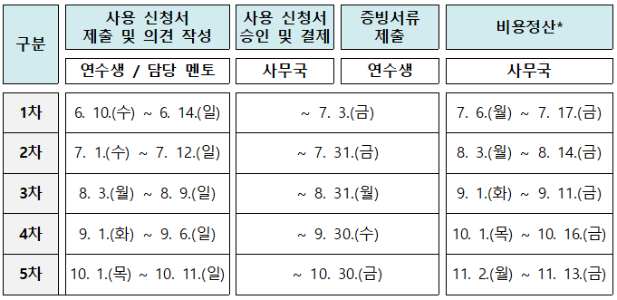
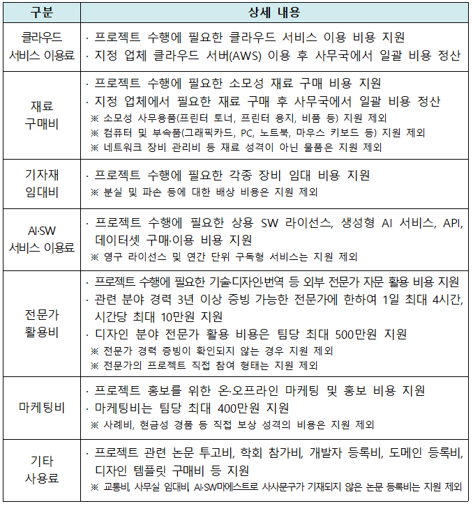

# 절차와 일정

이 문서는 원문 중 전체 공지, AWS 사전 설문, 지원 내용, 1~5단계 절차 설명을 모은 것입니다. 보드 카드의 세부 내용은 별도 보드 문서를 참조하세요.

# 프로젝트 활동비 지원 안내(2026년)

- Source: https://app.notion.com/p/swmaestromain/2026-c1091e401fdf82aab1d6812565ebe77a
- Root page ID: c1091e40-1fdf-82aa-b1d6-812565ebe77a
- Exported: 2026-06-06T17:39:40.782Z
- Loaded pages: 23
- Queried board/database views: 5
- Downloaded assets: 50/50

> ‼️ 
  **✔[프로젝트 활동비 활용계획서] & [클라우드 서비스 사용 동의서]  : ****6월 1일(월) ~ 6월 7일(일) 까지 제출!! **

   ※ 제출한 서류는 사무국에서 검토 및 승인 예정입니다.
   ※ **해당 양식과 제출 방법은 각각 “1단계 활용계획서 작성”, “2단계 사용 신청서 제출의 클라우드 서비스 이용료 안내” 에서 확인**하실 수 있습니다.

  **✔ ****1차 사용 신청 기간 : ****6월 10일(수) ~  6월 14일(일) 까지 1차 신청 가능!!**

   ※ 원활한 신청을 위해 사용 신청 기간 전 신청 예정 항목을 미리 검토해 주시기 바랍니다.
   ※ 사용 신청 기간 전 사용 신청서 제출 건은 반려 처리됩니다.
   ※ **[활용계획서] 승인 전 사용 신청은 반려 처리됩니다.**
       (예외 : 클라우드 서비스 이용료 신청은 **6월 1일(월) ~ 6월 7일(일)** 까지 신청해주기 바랍니다.
       (최초 1회만 신청, [클라우드 동의서] 제출)

  **✔ ****사용 신청 승인 **: 신청서의 멘토 의견 작성일로부터 근무일(주말 및 공휴일 제외) 5일 내 승인

   ※ 승인 여부 및 승인 시점은 신청 건별 검토 상황에 따라 상이하므로 개별 문의에는 답변이 어려운 점 양해 부탁드립니다.

  **✔ ****사용 신청 승인 후 결제 방법 **: 사무국 담당자와 미리 약속 시간을 조율 후 해당 시간 사무국 방문 원칙

  **✔**** 각 팀별로 웹엑스 스페이스 생성 예정 : **‘재료 구매 사이트’ 계정 생성 관련 웹엑스 DM 예정

  **✔ 사무국 카드 결제를 무단으로 취소 및 환불 처리하는 것은 절대 금지됩니다.**

  **✔ 사전 승인 없이 추가 비용 결제를 하는 것은 절대 금지됩니다.**

  ✔ **동일한 지원 항목은 하나의 신청서로 묶어 신청하고, 지원 항목이 다른 경우에는 각각 별도의 신청서로 제출해 주시기 바랍니다.**

## 📑목차

[Table of contents]

## ■ AWS 클라우드 서비스 이용 사전 설문조사(필수!!)

본격적인 팀 프로젝트 활동비 지원에 앞서 AWS 클라우드 서비스 이용을 위한 사전 설문조사를 진행하고자 합니다. 아래 내용을 확인하시어 **6월 2일(화), 오후 2시까지** 설문을 반드시 제출해 주시기 바랍니다.

---

**✔** **설문조사 링크 : **[**https://forms.gle/mqwdc3mZH9NY3vVH9**](https://forms.gle/mqwdc3mZH9NY3vVH9)

**✔** 위 설문조사는 AWS 계정 생성 및 AWS 클라우드 서비스 온라인 교육 참석 여부를 조사하기 위한 설문입니다. **각 팀별 한 분만 작성**해 주시기 바랍니다.

**✔** **AWS 계정 생성은 팀별 1개, 팀원 중 한 분의 명의로 대표 계정을 생성**해주세요.

**✔** **통합 빌링 연동 전 서비스 사용 시 개인 과금이 발생할 수 있습니다. 통합 빌링 연동 초대 적용 전 서비스 사용은 금지하며, 해당 기간 중 발생한 비용은 지원되지 않습니다.(사용 신청서 승인 여부 확인 후 사용)**

**✔** AWS 계정 생성은 다음과 같이 진행될 예정입니다. 자세한 내용은 첨부 파일을 참조해주세요.

- **1단계 : AWS 계정 생성(연수생)** / **계정 생성 과정에서 개인 카드 등록 필요**

- **2단계 : AWS 계정 MFA 설정(연수생)**

- **3단계 : 설문조사 링크를 통해 AWS 루트 계정 이메일 작성 제출(연수생) **

- **4단계 : 계정 취합 이후 통합 빌링 초대 메일 발송(지정 업체)**

- **5단계 : 통합 빌링 연동 수락(연수생)**
  [AWS 계정 생성 및 통합빌링 가이드.pdf](assets/37091e40-1fdf-8024-a20b-fd2e219ac5b9-AWS%20%EA%B3%84%EC%A0%95%20%EC%83%9D%EC%84%B1%20%EB%B0%8F%20%ED%86%B5%ED%95%A9%EB%B9%8C%EB%A7%81%20%EA%B0%80%EC%9D%B4%EB%93%9C.pdf)

## ■ 프로젝트 활동비 지원 내용

**✔ (중요!!) 지원 일정**

**      ※ AWS 클라우드 서비스 이용은 프로젝트 최종 점검까지 가능**

**✔ 지원 항목**

**      ※ 상기 지원 내용은 운영 상황 및 예산 집행 여건 등에 따라 변경될 수 있음**

**✔ 지원 금액 : 팀당 최대 1,200만원**

**      ****※ 팀 지원 제한금액을 초과할 경우 팀 구성원의 월 장학금에서 균등분할하여 차감**

## ■ 프로젝트 활동비 지원 절차

##### 1단계 : 활용계획서 제출

- 프로젝트 활동비 **활용계획서 승인 완료 후**에 본격적인 활동비 사용 신청이 가능합니다.

- 활용계획서의 내용과 추후 실제로 사용한 활동비 내역이 달라도 괜찮습니다.
앞으로 어떻게 프로젝트 활동비를 사용할지 말 그대로 계획을 세우는 단계이니, 프로젝트 진행 계획에 맞추어서 예산 사용 계획을 세워보세요!

- 자세한 사항은 아래의 각 제출 단계를 클릭해서 확인해주세요!😎

##### 2단계 : 사용 신청서 제출

- 실제 활동비 사용을 위한 **신청서를 작성하고 승인 이후에 구매/지원이 이루어집니다.(사전에 사용 신청서 제출 및 승인을 받지 않은 항목은 절대 지원 불가!)**

- 사용 신청서는 활용계획서를 기준으로 작성하여야 하며, 실제 프로젝트 진행 상황에 따라 필요한 경우 내역을 조정하여 신청할 수 있습니다.

- 동일한 지원 항목은 하나의 신청서로 묶어 신청하고, 지원 항목이 다른 경우에는 각각 별도의 신청서로 제출해주세요.

- 자세한 사항은 각 지원 항목을 클릭해서 확인해주세요!😎

##### 3단계 : 멘토 의견 작성

- 신청한 항목이 프로젝트에 필요한지 여부에 대해 담당 멘토님 중 최소 1명의 의견 작성이 필요합니다.(최소 30자 이상)

- 사용 신청서 제출 후, 담당 멘토님에게 신청서 검토와 의견 작성을 요청하세요!

- 신청한 항목이 프로젝트에 필요한지 여부를 멘토님께서 검토해주시는 단계입니다.
**”승인합니다”, ”확인했습니다” 와 같이 한 마디만 작성하는 건 지양해주시기 바랍니다.**

- 멘토님 의견이 작성되지 않으면 사무국 검토 및 승인이 이루어지지 않습니다.

- **의견 작성 예시 : “프로젝트 진행을 위해 필요한 라이선스임을 확인했습니다.”**

---

##### 4단계 : 사무국 승인 및 결제

- 멘토 의견 작성일로부터 근무일(주말 및 공휴일 제외) 5일 내 제출 순서대로 사용 신청서 승인/반려 처리됩니다.

- **승인이 언제 되는지에 대한 문의에는 일절 답변하지 않습니다.**

- 신청서 승인 후 결제 및 비용 지급이 이루어집니다.

- **신청서 승인 전 결제 및 비용 지원은 절대 불가합니다.**

- **연수생에게 비용을 지급/환급해드리는 것은 절대 불가합니다. **

- **사무국을 통한 결제 및 비용 지급만 가능하며, 연수생이 개인적으로 먼저 결제한 사항은 절대 비용 지급이 불가합니다.(예외 : AI·SW 서비스 이용료)**

**사용 신청서 반려 시 확인사항**

- 반려되는 경우 수정 요청사항을 상단의 붉은 창에서 확인할 수 있습니다.

- 신청서를 수정하면 신청서 상태가 자동으로 다시 [접수중] 으로 변경되며, 수정일 기준으로 근무일(주말 및 공휴일 제외) 5일 이내에 신청서 재검토가 이루어집니다.

- **주요 반려 사유**는 다음과 같습니다.
  - 지원 불가한 품목, 프로젝트와 관련성이 없는 품목 신청

  - 구매 사유 작성이 미흡한 경우

  - 안내된 작성 양식에서 필수적으로 작성되어야 하는 내용이 누락된 경우

  - 이외 사전에 안내된 내용과 어긋난 사항이 있는 경우

- 자세한 사항은 각 지원 방식을 클릭해서 확인해주세요!😎

##### 5단계 : 증빙서류 제출

- **카드 결제 영수증은 결제 및 구매가 완료된 날에 바로 제출**해야 합니다.

- 재료 구매비, 기자재 임대비의 경우 제품(기자재)를 수령받는대로 증빙서류를 제출해주세요!

- **증빙자료 제출기간 내 증빙 내역서를 제출하지 못한 경우는 활동비로 인정되지 않습니다. 인정되지 않은 활동비는 팀 구성원의 월 장학금에서 균등분할하여 차감되니, 꼭 회차별 기간 내에 제출해주세요!**

- **증빙서류를 제출하지 못한 경우, 증빙서류 제출 완료 시 까지 다음 회차 신청서 승인이 불가합니다!**

- **전문가 활용비는 각 회차별 지정된 제출기간 내 증빙서류 제출을 원칙으로 하며, 작업 기간이 여러 회차에 걸치는 경우, 진행 현황을 확인할 수 있는 증빙 내역서를 매 회차 제출해야 합니다.**

- **예를 들어 6월 10일 1차에 신청한 전문가 디자인 활용의 작업 종료일이 9월 10일인 경우 최초 신청서의 [증빙하기] 를 통해 1차(중간), 2차(중간), 3차(중간), 4차(최종) 총 4회를 제출해야합니다.**

- **증빙서류 미제출 시 비용 지급이 제한될 수 있으니 신청 시 유의해주시기 바랍니다!**

- 각 지원 항목의 신청 건들은 신청 내역 옆에 보이는 [증빙하기] 를 눌러 증빙서류를 업로드해주세요. (클라우드 서비스 이용료는 최초 1회 동의서를 제출해주시고, 이후 추가 신청 및 제출은 없습니다.)
  

- 어떤 증빙서류를 제출해야 하는지에 대한 자세한 사항은 아래의 각 지원 항목을 클릭해서 확인해주세요!😎
