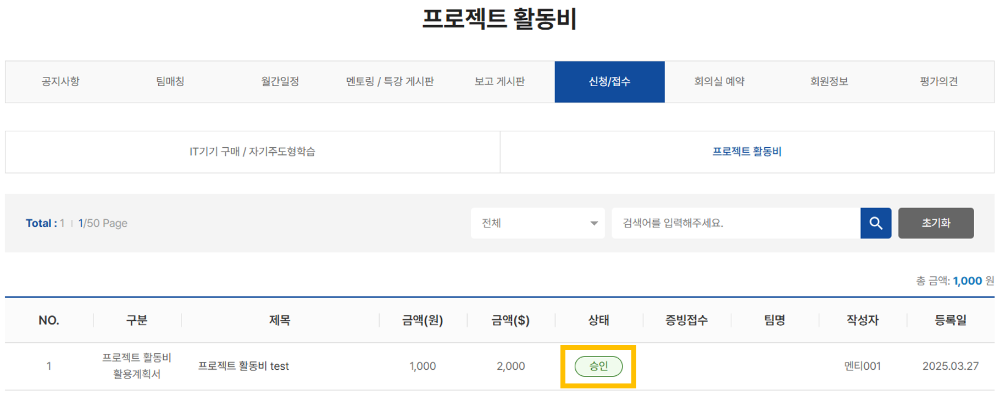
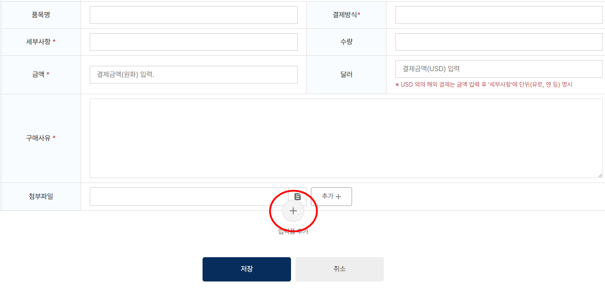
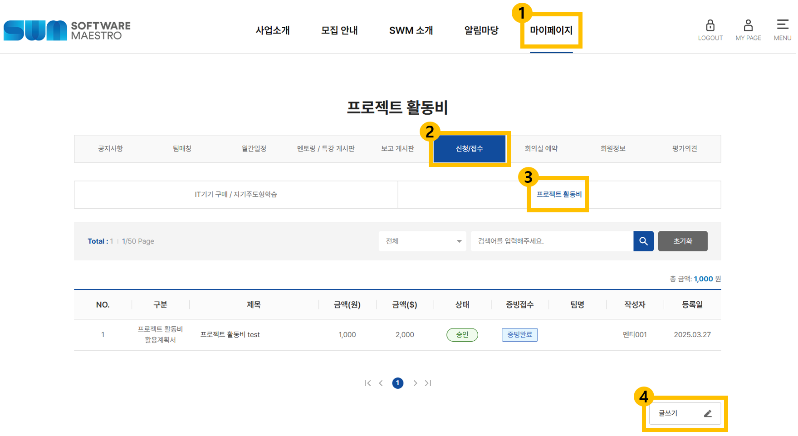

# Board: 활동비 활용계획서

#### Board: 활동비 활용계획서

- View: 보드 보기
- Rows: 4

##### Group: 활용계획서

###### **활용계획서 작성**

- i_ED: 활용계획서
- 선택: 활용계획서

1. 첨부된 [프로젝트 활동비 활용계획서] 양식 다운로드
  [(양식) 프로젝트 활동비 활용계획서_000팀.docx](assets/37091e40-1fdf-8067-b455-dc9a95b67e91-%28%EC%96%91%EC%8B%9D%29%20%ED%94%84%EB%A1%9C%EC%A0%9D%ED%8A%B8%20%ED%99%9C%EB%8F%99%EB%B9%84%20%ED%99%9C%EC%9A%A9%EA%B3%84%ED%9A%8D%EC%84%9C_000%ED%8C%80.docx)

1. 아래의 안내에 따라 내용 작성(해당 항목의 지원 범위 안내도 꼭 함께 확인!)
  > 📝 **활용계획서 작성 가이드라인**
    - **클라우드 서비스 이용료 **: 프로젝트에 클라우드 서비스가 필요한 사유, 예상 금액, 사용 기간 작성

    - **재료 구매비 **: 프로젝트에 필요한 재료 종류와 사유, 각 항목의 금액 작성

    - **기자재 임대비 **: 프로젝트에 필요한 기자재 종류와 사유, 각 항목의 임대료 작성

    - **AI·SW 서비스 이용료 **: 프로젝트에 필요한 AI·SW 서비스 종류와 사유, 각 항목의 금액과 사용 기간 작성

    - **전문가 활용비 **: 프로젝트에 필요한 전문가 자문 분야와 사유, 각 항목의 예상 인원과 금액 작성
    ※ 전문가 활용비 중 디자인 제작비(디자인 전문가 활용비)의 경우 총 500만원으로 제한됨

    - **마케팅비 **: 연수과정 중 프로젝트 홍보/마케팅 진행 시 사용하려는 플랫폼과 필요 사유, 예상 금액과 사용 기간 작성
    ※ 마케팅비의 경우 총 400만원으로 제한됨

    - **기타 사용료 **: 프로젝트에 필요한 기타 사용료 종류와 사유, 각 항목의 금액 작성

###### Board: 활동비 지원 항목

- View: 보드 보기
- Rows: 7

###### Group: 지원 항목

###### 클라우드 서비스 이용료

- 선택: 지원 항목

- 지원 범위 : **AWS 클라우드 서비스**
  - 팀별 1개(팀원 중 한 명) 의 AWS 계정을 생성하여, 설문조사를 통해 루트 계정 이메일 주소를 제출해주세요.
   **※ 설문조사 링크 : **[**https://forms.gle/LeXPguQmQwG5vMmL9**](https://forms.gle/LeXPguQmQwG5vMmL9)
   ※ 아래의 [AWS 계정 생성 가이드] 파일 참조
    [AWS 계정 생성 및 통합빌링 가이드.pdf](assets/37091e40-1fdf-804c-b4c7-f623743e8a54-AWS%20%EA%B3%84%EC%A0%95%20%EC%83%9D%EC%84%B1%20%EB%B0%8F%20%ED%86%B5%ED%95%A9%EB%B9%8C%EB%A7%81%20%EA%B0%80%EC%9D%B4%EB%93%9C.pdf)

  - 과도한 사용으로 활동비 지원금을 초과할 수 있으니 팀별로 실시간 관리해 주시기 바랍니다.

  - **GCP, Azure 지원 불가**

  - **통합 빌링 연동 전 서비스 사용 시 개인 과금이 발생할 수 있습니다. 통합 빌링 연동 초대 적용 전 서비스 사용은 금지하며, 해당 기간 중 발생한 비용은 지원되지 않습니다.
  (사용 신청서 승인 여부 확인 후 사용)**

- 지원 방법 : 지정 업체를 통해 계정을 생성한 뒤 이용이 가능하며, 이용 금액은 사무국에서 일괄 비용 정산
  - 신청서 1회 제출 후 추가적인 신청서 제출 필요 없음

  - 클라우드 서비스 이용에 따른 별도 증빙 제출 필요 없음

  - 매월 클라우드 서비스 이용료가 자동으로 팀 프로젝트 활동비에 정산됨**(정산**** 비용 = 월 서비스 사용료 + 부가세 10%)**

- **지원 마감일 : 최종점검일**

- **데이터 이관 기간 : 최종점검일 ~ 11월 27일(금)(11월 27일(금), 13시 이후 계정 완전 삭제!**

###### ▷ 신청 방법

1. 아래의 [클라우드 서비스 사용 동의서] 양식 다운로드
  [(양식) 클라우드 서비스 사용 동의서_000팀.docx](assets/37091e40-1fdf-804c-b93b-f1c0160df6df-%28%EC%96%91%EC%8B%9D%29%20%ED%81%B4%EB%9D%BC%EC%9A%B0%EB%93%9C%20%EC%84%9C%EB%B9%84%EC%8A%A4%20%EC%82%AC%EC%9A%A9%20%EB%8F%99%EC%9D%98%EC%84%9C_000%ED%8C%80.docx)

1. 양식 내용 검토 후 자필/전자 서명**(이름 타이핑은 인정 불가)**

1. [마이페이지] → [신청/접수] → [프로젝트 활동비] → [글쓰기]
  

1. 아래의 안내에 따라 내용 작성 후 [사용 동의서] 제출
  > 📝 **클라우드 서비스 이용료 신청 가이드라인**
    - 구분 : [프로젝트 활동비] 선택

    - 제목 : **“****클라우드 서비스**” 작성

    - 상세구분 : [클라우드 서비스] 선택

    - 품목명 : “**AWS**” 작성

    - 결제방식 : “**사무국**” 작성

    - 세부사항 : “**없음**” 작성

    - 수량 : [빈칸]

    - 금액 : “**0**” 작성
      - 실제 사용량에 따른 비용 금액을 사무국에서 추후 반영

    - 구매사유 : 해당 항목이 프로젝트에 필요한 사유 작성
      - 회계사, 담당 멘토, 사무국 담당자가 팀 프로젝트와의 관련성을 파악할 수 있도록 작성

      - 최소 30자(공백 미포함) 이상 작성

    - 첨부파일 : [클라우드 서비스 사용 동의서] 서명본 파일 첨부

1. 아래와 같이 승인 완료 후 클라우드 서비스 이용 가능**(승인 전 서비스 사용 불가, 개인 과금 발생)**
  

###### **※ 통합 빌링 기능 추후 안내 예정**

###### **※ 유의사항**

- 통합 빌링 이용 가이드 : 

- **클라우드 서비스 이용료가 활동비 1,200만원을 초과할 경우 균등분할하여 팀원의 월 장학금에서 차감됨**

- 계정정보 유출 및 해킹으로 인한 구제 요청은 사용자가 직접 진행해야 함

- 보안정책 위반에 대하여 시정요구를 거부할 시 계정 사용이 중지될 수 있음
###### 재료 구매비

- 선택: 지원 항목

- 지원 범위 : 프로젝트 수행에 필요한 소모성 재료 구매 비용(시제품 제작 또는 시공에 소요되는 각종 재료 등)
  

  
**지원 가능 항목**

  - 아두이노, 라즈베리파이 ⭕

  - 젯슨 나노, 터틀봇, 구글 코랄 개발 보드 ⭕

  - 허브 (벨킨 등) ⭕
    - 팀원당 1개, 개당 200,000원 이내 지원 가능(VAT 포함 금액)

  - 외장 SSD ⭕
    - 팀당 1개, 1TB 이내 지원 가능

  - ipTIME 등 유무선 공유기 ⭕
    - 팀당 1개 (프로젝트 결과물에 직접적으로 사용되는 경우에만 지원 가능, ex. 라즈베리파이 등을 이용한 하드웨어 개발 시)

  - 프로젝트와 관련 있지만 [기자재 임대비] 로 임대가 불가능한 물품 ⭕ 
  

  

  
**지원 불가 항목**

  - 컴퓨터 및 부속 용품(PC, 노트북, 마우스, 키보드 등) ❌

  - 컴퓨터 부품(CPU, GPU, RAM, POWER 등) ❌

  - 모니터, 포터블 모니터 ❌

  - 사무용품(프린터 토너, 프린터 용지, 비품 등) ❌

  - NAS, NAS용 HDD ❌

  - 오실로스코프, 멀티미터 ❌

  - 네트워크 장비 관리비 등 재료(소모성)의 성격이 아닌 물품 ❌

  - 팀 프로젝트 개발과 직접적으로 관련이 없는 물품 ❌
  

- 지원 방법 : 지정 구매처를 통한 물품 구매 후 구매 비용은 사무국에서 일괄 정산
  - 지정 구매처 : 디바이스마트(www.devicemart.co.kr)

  - **제품 가격은 꼭 디바이스마트를 통해서 확인**

  - 디바이스마트에서 판매되지 않는 재료는** ****디바이스마트 구매대행**을 통해서 구매 가능 

   ※ 자세한 사항은 아래의 🖥**디바이스마트 구매(재료 구매비)** 안내 참조

  [alias]

###### ▷ 신청 방법

1. [마이페이지] → [신청/접수] → [프로젝트 활동비] → [글쓰기]
  

1. 아래의 안내에 따라 내용 작성 후 재료 구매비 사용 신청서 제출
  > 📝 **재료 구입비 신청 가이드라인**
    - 구분 : [프로젝트 활동비] 선택

    - 제목 : “**재료 일반구매(신청일)**” 또는 “**재료 구매대행(신청일)**” 작성 
               (ex. 재료 일반구매(6/10) 또는 재료 구매대행(6/10))

    - 상세구분 : [재료 구매비] 선택

    - 품목명 : 구매 희망 품목명 작성(ex. 벨킨 허브)

    - 결제방식 : “**디바이스마트**” 작성

    - 세부사항 : 디바이스마트 사이트에 명시된 품목의 구체적인 모델명 작성 
    (ex. [Belkin] 벨킨 INC009b (USB허브/7포트/멀티허브) ▶ [무전원/C타입] ◀)

    - 수량 : 수량 작성

    - 금액 : 금액 작성
      - 개별 단가가 아닌 **총액**으로 작성

      - 디바이스마트에서 확인한 부가세 10% 포함 금액으로 작성 
      (활동비에서도 부가세 10% 포함 금액 기준으로 차감)

      - ***(구매대행인 경우***) “**0**” 으로 작성해두고, 추후 사무국에서 전달하는 견적 확인 후 금액을 수정

    - 구매사유 : 해당 항목이 프로젝트에 필요한 사유 작성
      - 회계사, 담당 멘토, 사무국 담당자가 팀 프로젝트와의 관련성을 파악할 수 있도록 작성

      - 최소 30자(공백 미포함) 이상 작성

    - 첨부파일 : ***(구매대행인 경우)*** 아래의 [구매대행 신청서] 파일 첨부
      [(양식) 구매대행 신청서_팀명_00.00.xlsx](assets/35f91e40-1fdf-8026-a58a-c9372e9031ec-%28%EC%96%91%EC%8B%9D%29%20%EA%B5%AC%EB%A7%A4%EB%8C%80%ED%96%89%20%EC%8B%A0%EC%B2%AD%EC%84%9C_%ED%8C%80%EB%AA%85_00.00.xlsx)

      

      
**디바이스마트 구매대행 신청서 작성 가이드라인**

      디바이스마트 내에서 구매할 수 없는 제품을 구매 시, 구매대행 신청 통해 구매 진행이 가능합니다. 다만, **구매대행 신청 시 [구매대행 신청서] 는 필수 첨부 **서류이니 아래의 가이드라인을 참조하여 신청서를 첨부해주세요! 

      > 📝 **구매대행 신청서 작성 가이드라인**
        - 파일명: [구매대행 신청서_팀명_신청일] (ex. 구매대행 신청서_소마팀_6.10.)
          **※ 파일은 엑셀(.xlsx) 확장자로 제출!!**

        - 성명 : 주문자 성명(수령인명) 작성

        - 주문ID : 디바이스마트 ID 작성

        - 연락처 : 주문자(수령인) 전화번호 작성

        - 이메일 : 주문자(수령인) 이메일 작성

        - 주소 : 수령 주소지 작성
          **※ 필요 시 연수센터로 물건을 배송해도 괜찮으나 꼭 ****배송 후 일주일 내로 물품을 수령**

        - 개인통관고유부호 : 주문자(수령인)의 고유부호 작성(해외배송의 경우)
          ※ 개인통관고유부호란? 다음 안내 페이지를 참고해서 작성해주세요!**
          **[**https://unipass.customs.go.kr/csp/persIndex.do?search_put=**](https://unipass.customs.go.kr/csp/persIndex.do?search_put=)

        - 필요 서류: [빈칸]
      

    - 여러 제품을 한 번에 주문하는 경우, **[+] 버튼을 이용해 함께 주문하는 제품들을 추가하여 하나의 사용 신청서로 제출**
      

     ※ 함께 주문한 제품들이 별도의 사용 신청서로 제출된 경우, 반려/취소
     ※ 디바이스마트 [재료 일반구매] 와 [재료 구매대행] 은 별도의 신청서로 제출
     ※ 사무국 승인이 이루어진 뒤에 디바이스마트에서 해당 제품을 구매 주문!!
          (승인 전에 구매 주문한 제품은 주문이 자동 취소됨)

###### ※ 유의사항

- 지원 불가 항목은 사유에 상관없이 무조건 구매할 수 없음

- 사무국 승인이 이루어지지 않은 항목은 디바이스마트에서 구매 주문을 하더라도 반려/취소됨

- 배송비도 팀 활동비에 포함되어 정산됨

- **그래픽카드는 온라인 그래픽카드만 지원하며, 온라인 렌탈 사이트(Vast.ai 등) 활용하여 결제 진행
※ 온라인 그래픽카드는 기타 사용료 지원 항목이므로, 재료 구매비 항목으로 신청 불가**
###### 기자재 임대비

- 선택: 지원 항목

- 지원 범위 : 프로젝트 수행에 필요한 각종 장비 임대 비용

- 지원 방법 : 사무국 방문 카드 결제, 세금계산서 대납

###### ▷ 신청 방법

1. [마이페이지] → [신청/접수] → [프로젝트 활동비] → [글쓰기]
  

1. 아래의 안내에 따라 내용 작성 후 사용 신청서 제출
  > 📝 **기자재 임대비 신청 가이드라인**
    - 구분 : [프로젝트 활동비] 선택

    - 제목 : “**기자재 임대비(신청일****)**” 작성(ex. 기자재 임대비(6/10))

    - 상세구분 : [기자재 임대비] 선택

    - 품목명 : 임대 희망 품목명 작성(ex. 삼성 갤럭시폰)

    - 결제방식 : “**카드결제**” 또는 “**세금계산서**” 중 해당되는 결제방식 작성

    - 세부사항 : 품목 모델명 및 구매 사이트 등 작성(ex. 갤럭시 z폴드3)

    - 수량 : 수량 작성

    - 금액 : 금액 작성

    - 달러 : ***(해외 화폐 결제 시)*** 달러 작성(ex. 25.9달러일 시 25달러로 작성)

    - 구매사유 : 해당 항목이 프로젝트에 필요한 사유 작성
      - 회계사, 담당 멘토, 사무국 담당자가 팀 프로젝트와의 관련성을 파악할 수 있도록 작성

      - 최소 30자(공백 미포함) 이상 작성

    - 첨부파일 : 구매 사이트 [결제 금액 화면 캡쳐 사진] 이미지 첨부

    - 여러 기자재를 한 번에 임대하는 경우, **[+] 버튼을 이용해 함께 주문하는 제품들을 추가하여 하나의 사용 신청서로 제출**
      

            ※ 함께 주문한 제품들이 별도의 사용 신청서로 제출된 경우, 반려/취소

###### ※ 유의사항

- 임대비 외 분실·파손 등의 배상금액 지원 불가

- 장비(완제품 기기, 기자재) 구매 절대 불가

- **기자재 임대는 정식으로 임대업을 영위하는 업체를 통해서만 가능하며, 개인 간 거래를 통한 임대는 불가**
###### AI·SW 서비스 이용료

- 선택: 지원 항목

- 지원 범위 : 프로젝트 수행에 필요한 상용 SW 라이선스, 생성형 AI 서비스, API, 데이터셋 구매·이용 비용
  - **“*****월 단위 구독형 서비스*****” ****및 ****“*****선불 충전(결제) 방식*****”**** ****의 서비스에 한하여 지원 가능하며, 후불 결제 방식은 지원 대상에서 제외**

  - ***“******월 단위 구독형 서비스******” *****는 ****최초 신청서 1회 제출****만 필요하며, 이후 별도 신청 없이 최초 신청서의 [증빙하기] 기능을 통해 ****매 회차 증빙 내역서를 반복해서 제출****(증빙 내역서 미제출 시 해당 기간의 개인 결제 건은 지원 대상에서 제외)**

  - **“*****선불 충전(결제) 방식*****” ****인 경우는 선불 충전 금액 소진 시 추가 신청 및 결제가 가능하며, ****재신청 시에는 기존 충전 금액의 소진 내역을 확인할 수 있는 이미지를 추가 제출**

  - 영구 라이선스 및 연간 단위 구독형 서비스는 지원 불가

  - USB 등 실물 형태의 저장매체 구매는 지원 불가

  

  
**지원 가능 항목**

  - SW 라이선스 ⭕

  - 생성형 AI 서비스 ⭕

  - 최대 사용량 / 금액 제한, 월정액제 형태의 **AP**I 사용비 ⭕
    - 클라우드 서비스 이용료 지원 범위에 해당되는 서비스 제외(AWS)

    - 제한 없이 사용량에 따른 후불 과금제 형태의 API는 지원 불가

  - 데이터셋 구매비 ⭕
  

- **지원 방법 : 연수생 선 결제 후 사후 정산**
  - 동일한 서비스를 여러 건 구매하는 경우, 팀원 숫자만큼만 결제 가능

  - **공식 제공처(정식 판매처)를 통한 구매 건에 한하여 지원하며, 비공식 판매 경로를 통한 구매 건은 지원 불가!**

  - **사무국 승인 후 결제한 건에 한하여 지원 가능하며, 승인 전에 개인 결제 건은 지원 불가!**

###### ▷ 신청 방법

1. [마이페이지] → [신청/접수] → [프로젝트 활동비] → [글쓰기]
  

1. 아래의 안내에 따라 내용 작성 후 사용신청서 제출
  > 📝 **AI·SW 서비스 이용료 신청 가이드라인**
    - 구분 : [프로젝트 활동비] 선택

    - 제목 : “**AI·SW 서비스 이용료(신청일)**” 작성(ex. AI·SW 서비스 이용료(6/10))

    - 상세구분 : [AI·SW 서비스 이용료] 선택

    - 품목명 : 구매 희망 품목명 작성(ex. 한컴 오피스)

    - 결제방식 : “**사후정산**” 작성

    - 세부사항 : 구독 기간 및 구매 사이트 등 작성

    - 수량 : 수량 작성

    - 금액 : 금액 작성 (1개월 단위 금액)

    - 달러 : ***(해외 화폐 결제 시)*** 달러 작성(ex. 25.9달러일 시 25달러로 작성)

    - 구매사유 : 해당 항목이 프로젝트에 필요한 사유 작성
      - 회계사, 담당 멘토, 사무국 담당자가 팀 프로젝트와의 관련성을 파악할 수 있도록 작성

      - 최소 30자(공백 미포함) 이상 작성

    - 첨부파일 : **(*****최초)*** 구매 사이트 [결제 금액 화면 캡쳐 사진] 이미지 첨부
                    ***(선불 충전 결제인 경우)****** (2~5회차) 구매 사이트 [결제 금액 화면 캡쳐 사진] 과 [충전 금액 소진 내역이 확인 가능한 캡쳐 사진] 이미지 첨부***

###### ※ 유의사항

- 프로젝트 및 프로젝트 개발과 직접 연관이 없는 서비스는 지원 불가

- ***“******월 단위 구독형 서비스******”****** *****는 ****최초 신청서 1회 제출****만 필요하며, 이후 별도 신청 없이 최초 신청서의 [증빙하기] 기능을 통해 ****매 회차 증빙 내역서를 제출****(증빙 내역서 미제출 시 해당 기간의 개인 결제 건은 지원 대상에서 ****제외)****
**※ 제출 완료 후 담당자가 확인할 수 있도록 웹엑스 DM으로 제출 사실을 전달해 주시기 바랍니다. 웹엑스 DM 미전달로 인해 제출 여부를 확인할 수 없는 경우 비용 정산이 불가능합니다!

- ***“선불 충전 (결제) 방식”***** 인 경우는 다음 회차 신청 시 구매 사이트 [결제 금액 화면 캡쳐 사진] 과 [충전 금액 소진 내역아 확인 가능한 캡쳐 사진] 이미지를 필수 첨부!**

- **신청서 승인 전에 개인 결제 건은 지원 불가**

- 도메인 등록비, 개발자 등록비는 기타 사용료 지원 항목임으로 신청시 유의

- 영구 및 연 단위 서비스 이용 지원 불가
  ※ 구매 옵션 중 기간 단위 구매가 없거나, 영구 및 연 단위 서비스 이용만 가능하다면 사무국 담당자에게 문의 
###### 전문가 활용비(디자인 제작비 포함)

- 선택: 지원 항목

- 지원 범위 : 프로젝트 수행에 필요한 기술·디자인·번역 등 외부 전문가 자문 활용 비용
  - 전문가는 **관련 직종에서의 경력이 3년 이상**이어야 하며, 이를 증명할 수 있는 **증빙 필요(이력서, 포트폴리오 등)**

  - **디자인 전문가 활용 비용은 최대 500만원**으로 제한(제한 금액을 초과할 경우 균등분할하여 팀원의 월 장학금에서 차감됨)
    ※ 경력 조건 및 증빙서류는 해당 전문가가 정말 팀 프로젝트에 도움을 줄 수 있는 자격이 되는지를 확인하기 위한 것입니다. 단순히 사무국에 서류를 제출하기 위해서만이 아니라, 팀 내에서도 필요한 실력을 갖춘 사람인지 여부를 확인하는 과정으로 여기고 경력과 관련 서류를 잘 확인하시기 바랍니다.

- 지원 방법 : 사무국 방문 카드 결제, 전문가 계좌이체 대납, 세금계산서 대납
  - 전문가와 작업을 진행하며 계약이 필요한 경우 아래의 [계약서] 양식 참조**(사무국에 제출해야 하는 양식이 아닙니다!)**

  - 계약서는 팀에 필요한 내용에 맞추어 세부 항목은 변경해서 사용

  - 해당 양식 그대로 계약할 필요는 없으나 필수적인 내용이 기본적으로 들어가 있는 계약서입니다.
  계약이 필요한 경우 해당 내용을 참고해서 계약을 하시는 것을 권장드립니다.
    [(참고) 전문가 계약서 양식.docx](assets/37191e40-1fdf-80fe-9609-e4cb2b0b5a59-%28%EC%B0%B8%EA%B3%A0%29%20%EC%A0%84%EB%AC%B8%EA%B0%80%20%EA%B3%84%EC%95%BD%EC%84%9C%20%EC%96%91%EC%8B%9D.docx)

###### ▷ 신청 방법

1. [마이페이지] → [신청/접수] → [프로젝트 활동비] → [글쓰기]
  

1. 아래의 안내에 따라 내용 작성 후 사용 신청서 제출**(전문가 경력 증빙 제출 필수!)**
  > 📝 **전문가 활용비 신청 가이드라인**
    - 구분 : [프로젝트 활동비] 선택

    - 제목 : “**전문가 활용비(신청일)**” 또는 “**디자인 제작비(신청일****)**” 작성
             (ex. 전문가 활용비(6/10) 또느 디자인 제작비(6/10))

    - 상세구분 : [전문가 활용비] 또는 [디자인 제작비] 선택

    - 품목명 : 의뢰를 희망하는 전문가의 분야 작성(ex. 디자인, 번역 등)

    - 결제방식 : “**계좌이체**” 또는 “**카드결제**” 또는 “**세금계산서**” 중 해당되는 결제방식 작성
      - 계좌이체의 경우 전문가 개인 계좌로 **세금 원천징수 후의 금액이 입금**되니 비용 협의 시 꼭 확인

      - 전문가가 해당 수입을 사업소득으로 신고하는지, 기타소득으로 신고하는지에 따라 다음과 같이 지급됨
      **사업소득: 3.3% 원천징수 후 비용 지급
      기타소득: 8.8% 원천징수 후 비용 지급(125,000원 이하 미징수)**

    - 세부사항 : 간단한 의뢰 내용 작성(ex. UI 디자인, 앱 내 문장 번역 등)

    - 수량 : 수량 작성

    - 금액 : 금액 작성

    - 달러 : ***(해외 화폐 결제 시)*** 달러 작성(ex. 25.9달러일 시 25달러로 작성)

    - 구매사유 : 해당 항목이 프로젝트에 필요한 사유 작성
      - 회계사, 담당 멘토, 사무국 담당자가 팀 프로젝트와의 관련성을 파악할 수 있도록 작성

      - 최소 30자(공백 미포함) 이상 작성

    - 첨부파일 : 전문가의 경력을 증명할 수 있는 [이력서, 포트폴리오 등] 파일 첨부
      - **관련 직종에서의 경력이 3년 이상인 경우에만 신청서 승인 가능**

      - 이력서의 기업 근무 이력은 구체적인 기업명과 기업 근무 기간이 꼭 명시

      - 포트폴리오는 프로젝트/작업물 각각의 작업 기간과 작업 목적이 꼭 명시
      (단순 개인 작업물, 학교 과제 등은 경력 기간으로 인정되지 않음)

      - 포트폴리오가 웹사이트의 형태로 있는 경우, 해당 사이트의 URL을 [세부사항] 에 작성

      - 개인이 아닌 기업을 통해 작업 의뢰를 하는 경우, 해당 기업의 업력이 3년 이상임을 증빙해야 함(사업자등록증과 기업 포트폴리오 모두 첨부)

###### ※ 유의사항

- **전문가 활용비 신청서 승인 전, 미리 작업을 진행한 뒤 신청서 제출을 한 정황이 확인되는 경우 해당 비용 지원 절대 불가(꼭 사전에 신청서 승인을 받은 뒤 전문가와의 작업을 시작하세요!)**

- 전문가 이력 및 경력이 부족한 경우, 혹은 경력 증빙이 미비한 경우 사용 신청서 반려
  - 정확한 근무 이력과 프로젝트 경험 등이 기재된 증빙만 인정 가능

  - 크몽 등 전문가 중개 플랫폼 내의 이력페이지 URL로는 명확한 기간 확인이 불가하여 경력 인정 불가

- **전문가가 프로젝트 개발에 직접적으로 기여하는 역할을 수행하는 경우 지원 불가**
  - 개발 전문가에게 외주를 맡기는 것은 일절 금지

  - 개발 관련 전문가 자문 일절 금지(해당 분야의 멘토님을 찾아 멘토링으로 진행해주세요!)

  - 팀 내에 관련 담당자가 부재한 경우, 단순 웹 퍼블리싱 등의 작업을 맡기는 것은 가능
###### 마케팅비

- 선택: 지원 항목

- 지원 범위 : 프로젝트 홍보를 위한 온·오프라인 마케팅 및 홍보 비용
  - **마케팅비는 팀당 최대 400만원**으로 제한(제한 금액을 초과할 경우 균등분할하여 팀원의 월 장학금에서 차감됨)

  - **“*****선불 충전(결제) 방식*****” ****에 한하여 지원하며, 사용량에 따라 사후 청구되는 후불 결제 방식은 지원 불가**

  - **선불 충전 금액 소진 시 추가 신청 및 결제가 가능하며, 재신청 시에는 기존 충전 금액의 소진 내역을 확인할 수 있는 이미지를 추가 첨부**

  - 사례비, 현금성 경품 등(기프티콘 등) 직접 보상 성격의 비용은 지원 불가

- 지원 방법 : 사무국 카드 결제, 세금계산서 대납

###### ▷ 신청 방법

1. [마이페이지] → [신청/접수] → [프로젝트 활동비] → [글쓰기]
  

1. 아래의 안내에 따라 내용 작성 후 사용신청서 제출
  > 📝 **마케팅비 신청 가이드라인**
    - 구분 : [프로젝트 활동비] 선택

    - 제목 : “**마케팅비(신청일)**” 작성(ex. 마케팅비(6/10))

    - 상세구분 : [마케팅비] 선택

    - 품목명 : 마케팅 희망 품목 작성(ex. 구글 광고, 페이스북/인스타그램 광고, 틱톡 광고, 온라인 배너 등)

    - 결제방식 : “**카드결제**” 또는 “**세금계산서**” 중 해당되는 결제방식 작성

    - 세부사항 : 마케팅 사이트 및 마케팅 진행/광고 게시 기간 등 작성(ex. 구글/6월30일까지)

    - 수량 : 수량 작성

    - 금액 : 금액 작성

    - 달러 : ***(해외 화폐 결제 시)*** 달러 작성(ex. 25.9달러일 시 25달러로 작성)

    - 구매사유 : 해당 항목이 프로젝트에 필요한 사유 작성
      - 회계사, 담당 멘토, 사무국 담당자가 팀 프로젝트와의 관련성을 파악할 수 있도록 작성

      - 최소 30자(공백 미포함) 이상 작성

    - 첨부파일 : ***(최초)*** 구매 사이트 [결제 금액 화면 캡쳐 사진] 이미지 첨부
                    ***(2~5회차)***** 구매 사이트 [결제 금액 화면 캡쳐 사진] 과 [충전 금액 소진 내역이 확인 가능한 캡쳐 사진] 이미지 첨부**

###### ※ 유의사항

- 마케팅비는 사용량에 따라 사후 청구되는 후불 결제 방식은 지원 불가

- **선불 충전 금액 소진 시 추가 신청 및 결제가 가능하며, 재신청 시에는 기존 충전 금액의 소진 내역을 확인할 수 있는 이미지를 첨부**
###### 기타 사용료

- 선택: 지원 항목

- 지원 범위: 프로젝트 수행에 필요한 기타 사용료 및 수수료 등
  

  
**지원 가능 항목**

  - 개발자 등록비 ⭕ (플랫폼별로 팀당 1회만 결제 가능)
    - 애플 개발자 등록비

    - 구글 개발자 등록비

  - 도메인 등록비 ⭕

  - 온라인 GPU 렌탈비 ⭕

  - Unity 에셋 구매비 ⭕

  - 논문 투고비 ⭕

  - 학회 등록비 ⭕
  

  

  
**지원 불가 항목**

  - 현금으로만 지급 가능한 항목 ❌

  - 교통비, 사무실 임대비 ❌

  - AI·SW마에스트로 사사문구가 기재되지 않은 학회/논문 등록비 ❌

  - 도서, 전자도서, 강의류 ❌

  - 이외 프로젝트와 직접적인 연관성이 없는 항목
  

- 지원 방법 : 사무국 방문 카드 결제, 세금계산서 대납

###### ▷ 신청 방법

1. [마이페이지] → [신청/접수] → [프로젝트 활동비] → [글쓰기]
  

1. 아래의 안내에 따라 내용 작성 후 사용신청서 제출
  > 📝 
    **기타 사용료 신청 가이드라인**

    - 구분 : [프로젝트 활동비] 선택

    - 제목 : “**기타 사용료(신청일)**” 작성(ex. 기타 사용료(6/10))

    - 상세구분 : [기타] 선택

    - 품목명 : 사용료 희망 품목 작성(ex. 애플 개발자 등록비)

    - 결제방식 : “**카드결제**” 또는 “**세금계산서**” 중 해당되는 결제방식 작성

    - 세부사항 : 특이사항 및 구매 사이트 등 작성

    - 수량 : 수량 작성

    - 금액 : 금액 작성

    - 달러 : ***(해외 화폐 결제 시)*** 달러 작성(ex. 25.9달러일 시 25달러로 작성)

    - 구매사유 : 해당 항목이 프로젝트에 필요한 사유 작성
      - 회계사, 담당 멘토, 사무국 담당자가 팀 프로젝트와의 관련성을 파악할 수 있도록 작성

      - 최소 30자(공백 미포함) 이상 작성

    - 첨부파일 : 구매 사이트 [결제 금액 화면 캡쳐 사진] 이미지 첨부

###### ※ 유의사항

- 애플/구글 개발자 등록의 경우 수일 또는 수주가 소요됨에 따라 팀에서 미리 계획 후 신청

- 지원 불가 항목은 사유에 상관없이 무조건 구매할 수 없음

- 카드 등록 횟수 초과로 인해 지원 불가 항목 발생할 수 있음

- 학회 등록, 논문 등록, 언론 홍보 등을 하는 경우에는 꼭 사전에 사무국 담당자에게 연락
  ※ 과정이 진행되는 중 프로젝트가 외부에 공개되는 경우, AI·SW마에스트로 사사문구가 꼭 기재되어야 하며 해당 문구가 제대로 들어갔는지 여부를 사무국에 꼭 검토받아야 합니다. 이를 따르지 않아 이후 생기는 문제에 대해서는 사무국에서 일절 책임질 수 없으니 유의하시기 바랍니다.

###### ★ 활용계획서 작성 시 유의사항

- **활용계획서의 내용과 추후 실제로 사용한 활동비 내역이 달라도 괜찮습니다**. 앞으로 어떻게 프로젝트 활동비를 사용할지 말 그대로 계획을 세우는 단계이니, 프로젝트 진행 계획에 맞추어서 예산 사용 계획을 세워보세요!

- 다만, 활용계획서에 작성된 내역은 사전에 프로젝트와의 관련성이 있다고 확인되었으므로 사용 신청 시 반려될 확률이 적으나, 활용계획서에 명시되지 않은 항목에 대해 사용 신청을 하는 경우 프로젝트와의 관련성이 없거나, 명확한 사유가 없다고 판단되면 반려될 수 있습니다.

- 사용 예산의 합계가 정확히 1,200만원일 필요는 없습니다. 하지만 **예산 합계가 1,200만원을 초과하는 경우에는 반려**됩니다.

- 항목마다 지원범위와 제약이 다르므로, 각 지원 항목별 안내를 확인하고 활용계획서를 작성해주시기 바랍니다.

- **항목별 지원 가능 범위를 벗어난 내역(지원 불가 항목, 지원 가능 금액 초과 등)이 작성된 경우 반려**됩니다.

- 프로젝트와 직접적인 연관이 확인되지 않으며, 필요 사유 또한 명확하지 않은 내역이 작성된 경우 반려됩니다.
###### 활용계획서 제출

- 선택: 활용계획서

1. [마이페이지] → [신청/접수] → [프로젝트 활동비] → [글쓰기]
  

1. 아래의 안내에 따라 내용 작성 후 활동비 활용계획서 제출
  > 📝 **활용계획서 제출 가이드라인**
    - 구분 : [프로젝트 활동비] 선택

    - 제목 : **“****프로젝트 활동비 활용계획서****”** 작성

    - 상세구분 : [프로젝트 활동비 활용계획서] 선택

    - 품목명 : “**프로젝트 활동비 활용계획서**” 작성

    - 결제방식 : “**없음**” 작성

    - 세부사항 : “**없음**” 작성

    - 수량 : [빈칸]

    - 금액 : “**0**” 작성

    - 구매사유 : “**프로젝트 활동비 활용계획서 제출**” 작성

    - 첨부파일 : [프로젝트 활동비 활용계획서] 파일 첨부
###### 담당 멘토 의견 작성

- 선택: 활용계획서

1. 활용계획서 내용이 적절한지에 대해 담당 멘토님 중 최소 1명의 의견 작성이 필요합니다. (최소 50자 이상)

1. 활용계획서 제출 후, 담당 멘토님에게 계획서 검토와 의견 작성을 요청하세요!

1. **활용계획서가 타당하게 작성되었는지 여부를 멘토님께서 검토해주시는 단계입니다.
”승인합니다”, ”확인했습니다” 와 같이 한 마디만 작성하는 건 지양해주시기 바랍니다.**

1. 멘토님 의견이 작성되지 않으면 사무국 검토 및 승인이 이루어지지 않습니다.

> ‼️ **의견 작성 예시**
사용량 예측 기반으로 비용이 적절히 산정된 것으로 보입니다. 클라우드와 GPT API 사용량에 따라 예산을 벗어나기 쉬우니 모니터링으로 비용관리에 신경쓰는 것이 필요해 보입니다.
###### 사무국 승인

- 선택: 활용계획서

1. 멘토님 의견 작성이 확인된 후 사무국 담당자 검토가 이루어집니다.

1. 반려되는 경우 수정 요청사항을 상단의 붉은 창에서 확인할 수 있습니다.

1. 주요 수정 요청사항은 다음과 같습니다.
  - 항목별 지원가능 범위를 벗어난 내역(지원 불가 항목, 지원 가능 금액 초과 등)

  - 프로젝트와 직접적인 연관이 확인되지 않으며, 필요 사유 또한 명확하지 않은 내역

1. 수정사항이 전부 반영되면 활용계획서 승인이 이루어지며, 승인이 이루어진 뒤 신청 기간동안 사용 신청서 제출이 가능합니다.

---

