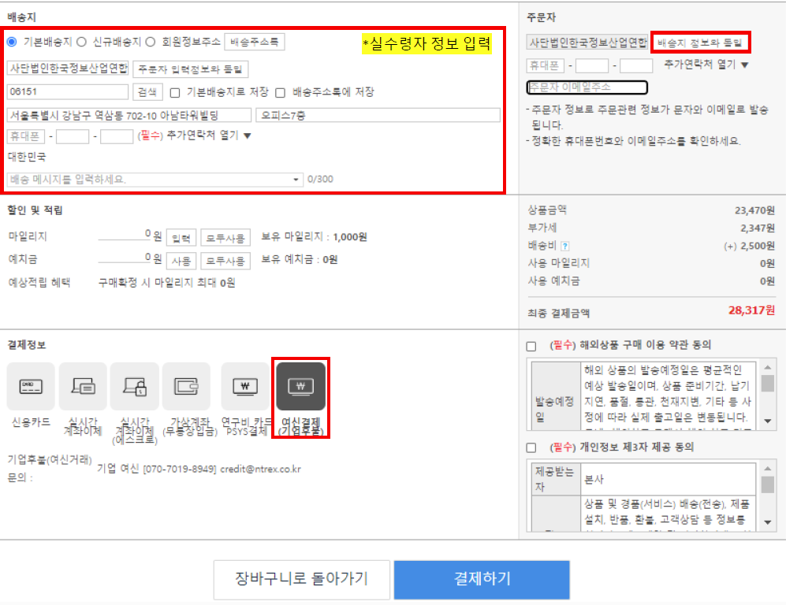

# Board: 활동비 지원 방식

#### Board: 활동비 지원 방식

- View: 보드 보기
- Rows: 5

##### Group: 지원 방식

###### 사무국 방문 카드 결제 

- 선택: 지원 방식

- **카드 결제를 무단으로 취소 및 환불 처리하는 것은 절대 금지됩니다.**
  - 불가피한 사유가 없거나 사전에 담당자의 확인을 받지 않고 무단으로 취소/환불처리를 하는 경우, 취소/환불 처리를 진행한 항목은 이후에 지원받을 수 없음**(ex. 무단으로 한컴 오피스 구독료 환불 처리를 한 경우 이후 AI·SW 서비스 이용료 지원 불가)**

- **연수생이 사무국 카드를 수령하여 결제하는 방식은 절대 불가능합니다.**

###### ■ 사무국 방문 카드 결제

1. **언제 방문하여 결제를 진행할지 각 팀별 웹엑스 스페이스를 통해 사무국 담당자와 미리 약속 시간 조율!**

1. 사전에 연수생 본인 노트북에서 결제를 진행할 사이트 로그인 및 주문 등, **카드 결제 직전의 모든 과정을 진행**

1. **카드 정보 입력 및 결제만 하면 되는 상태**로 노트북을 들고 사무국 방문

1. 사무국 담당자에게 팀명과 결제하려는 항목을 전달

1. 사무국 담당자가 승인된 항목임을 확인하면 결제 진행

1. 결제 완료 후, 사무국 담당자 안내에 따라 증빙서류 제출
###### 연수생 선결제 후 사후 정산

- 선택: 지원 방식

- **신청서 승인 전에 결제한 AI·SW 서비스 이용료는 사후 정산 지원이 불가능합니다.**

###### ■ 연수생 선결제 후 사후 정산(AI·SW 서비스 이용료에 한함)

1. 연수생은 AI·SW 서비스 이용료 사용 신청서를 제출

1. 사용 신청서 사무국 **승인 후 연수생이 개인 카드로 비용을 선결제**
  - 사무국 승인 전에 결제한 건은 지원 대상에서 제외

  - 결제 직후 업체 발행 결제 영수증은 당일 바로 사무국 담당자에게 웹엑스로 전달!!

1. 결제가 완료된 후 아래의 증빙서류 준비
  > 📝 **사후 정산 관련 서류**
    **AI·SW 서비스 이용료 증빙 내역서**

    - 아래의 양식 다운로드 후 작성
      [(양식) AI·SW 서비스 이용료 증빙 내역서.docx](assets/37191e40-1fdf-804c-a00f-ead0a63f1f5e-%28%EC%96%91%EC%8B%9D%29%20AI%C2%B7SW%20%EC%84%9C%EB%B9%84%EC%8A%A4%20%EC%9D%B4%EC%9A%A9%EB%A3%8C%20%EC%A6%9D%EB%B9%99%20%EB%82%B4%EC%97%AD%EC%84%9C.docx)

    - [업체 발행 결제 영수증]과 [카드사 매출전표] 각각 필수 첨부!!

    - 제출 기간 이후 제출된 증빙서류는 인정 불가

1. 위의 서류를 준비한 뒤 해당 회차 증빙서류 제출 기간 내 제출
  - 비용은 제출된 증빙서류를 기준으로 지급됨

1. 증빙서류 제출일 기준, 그 다음 달 15일 전후로 사무국에서 해당 연수생에게 비용 지급 예정
###### 디바이스마트 구매(재료 구매비)

- 선택: 지원 방식

- 모든 재료 구매비 지원 건은 지정 구매처를 통해서만 구매할 수 있습니다.

- 재료 구매비 지원 건은 구매 방식에 따라 **[재료 일반구매]** 또는 **[재료 구매대행]** 으로 구분되니 팀에서 희망하는 구매 방식을 자세히 확인해주세요.

###### ▷ 디바이스마트 계정 정보 확인 및 로그인

1. 사무국 담당자가 웹엑스 스페이스를 통해 **계정 생성 관련 인증번호 요청**

1. 계정 생성 완료 후 웹엑스 스페이스에 **디바이스마트 아이디 및 비밀번호 전달**

1. 디바이스마트 사이트 접속 및 로그인
  대한민국 전자부품 1등 쇼핑몰 디바이스마트

###### ■ [재료 일반구매]

- **재료 일반구매**** : 디바이스마트 내에서 검색 및 구매가 가능한 제품**

- 디바이스마트 **[여신거래(기업후불)]** 를 통한 제품 주문

---

1. 승인받은 재료 항목을 장바구니에 넣은 후 [주문하기]

1. 다음 안내에 따라 주문 내용 작성 후 [결제하기]

> 📝 **일반상품 주문 가이드라인**
  - 배송지 : 실제로 제품을 수령받을 배송지 입력
    **※** 필요 시 연수센터로 물건을 배송해도 괜찮으나 꼭 배송 후 일주일 내로 물품을 수령

  - 주문자 : 본인(팀원) 이름, 휴대폰, 이메일 주소 작성

  - 결제정보 : **[여신결제(기업후불)] 선택**

1. 사무국에서 팀별 주문 내역 확인 및 일괄 결제(개별적으로 결제 진행 요청할 필요 없음)

1. 주문자 연락처로 발송된 안내 메시지 확인 및 제품 수령

###### ■ [재료 구매대행]

- **재료 구매대행**** : 디바이스마트 내에서 검색 및 구매가 불가능한 제품**

- 별도의 구매대행 신청서 작성 후, 디바이스마트 구매대행을 통해 구매

---

1. 홈페이지에 사용 신청서 제출 및 멘토 의견 작성 후 사무국 담당자로부터 견적을 전달받을 때까지 대기
  **※ 멘토 의견 작성 후 디바이스마트에서 확인되는대로 사무국 담당자가 견적을 팀에 안내할 예정(수수료 및 부가세 포함 금액)**

1. 주문 제품에 대한 견적 확인 후, 견적에 맞추어 사용 신청서의 금액 수정 및 사무국 담당자를 통한 구매 진행 확정

1. 사무국에서 팀별 주문 내역 확인 및 일괄 결제(개별적으로 결제 진행 요청을 할 필요 없음)

1. 주문자 연락처로 발송된 안내 메시지 확인 및 제품 수령
###### 전문가 계좌이체

- 선택: 지원 방식

- 계좌이체는 전문가 활용 시에만 가능하며, 전문가 본인의 계좌로만 이체할 수 있습니다.
  - **연수생에게 직접 계좌이체 절대 불가**

  - **전문가 활용 용도가 아닌 경우 계좌이체 절대 불가**

- 비용 지급 시 해당 지급분에 대한 작업 결과물 및 증빙자료 제출이 필요하며, 결과물 확인이 불가능한 선금 지급은 불가능합니다.

###### ■ 전문가 계좌이체

1. 전문가 자문 및 작업이 완료된 후 아래의 증빙서류 준비
  > 📝 **전문가 활용비 계좌이체 관련 서류**
    **① 전문가 활용비 증빙 내역서**

    - 아래의 양식 다운로드 후 작성
      [(양식) 전문가 활용비 증빙 내역서_000팀.docx](assets/37191e40-1fdf-8014-9889-d2cce7557d52-%28%EC%96%91%EC%8B%9D%29%20%EC%A0%84%EB%AC%B8%EA%B0%80%20%ED%99%9C%EC%9A%A9%EB%B9%84%20%EC%A6%9D%EB%B9%99%20%EB%82%B4%EC%97%AD%EC%84%9C_000%ED%8C%80.docx)

    - **1일 최대 4시간, 시간당 10만원까지 인정(1일 최대 40만원 지원 가능)**

    - 위의 사항을 고려하여 지원을 받고자 하는 금액에 맞추어 증빙 내역서를 작성
      ※ 지원 가능 범위를 기준으로 전문가와 비용 협의 시 금액 책정하는 것을 권장드립니다.(전문가가 디자인 작업에 n시간이 걸릴 예정이라 하면 n*10만원으로 비용 책정, 전문가 자문을 n시간 받은 경우 n*10만원으로 비용 책정 등)

    **② 비용 지급요청서**

    - 아래의 양식 다운로드 후 작성
      [(양식) 비용 지급요청서(전문가 계좌이체)_000팀.docx](assets/37191e40-1fdf-8092-8a67-f436e97fb644-%28%EC%96%91%EC%8B%9D%29%20%EB%B9%84%EC%9A%A9%20%EC%A7%80%EA%B8%89%EC%9A%94%EC%B2%AD%EC%84%9C%28%EC%A0%84%EB%AC%B8%EA%B0%80%20%EA%B3%84%EC%A2%8C%EC%9D%B4%EC%B2%B4%29_000%ED%8C%80.docx)

    - **전문가 이름, 연락처, 은행명과 계좌번호가 모두 올바르게 작성되었는지 꼭 확인**

    - **사업소득, 기타소득 중 1개를 꼭 체크**
    (체크하지 않는 경우 별도 확인 없이 [기타소득]으로 신고하여 비용이 지급됨)
      - 전문가 개인 계좌로 **세금이 공제된 후의 금액이 입금**되니 비용 협의 시 꼭 확인

      - 전문가가 해당 수입을 사업소득으로 신고하는지, 기타소득으로 신고하는지에 따라 다음과 같이 원천징수
      **사업소득: 3.3% 원천징수 후 비용 지급
      기타소득: 8.8% 원천징수 후 비용 지급(125,000원 이하 미징수)**

    - **전문가 신분증 사본에는 성명, 주민등록번호가 모두 나와야 함 **
    (주민등록번호 뒷자리를 가리면 비용 지급 불가)

    - **전문가 통장 사본에는 예금주, 은행명, 계좌번호가 모두 나와야 함**

    **※ [증빙 내역서] 의 작업 일자와 [비용 지급요청서] 의 작성일이 동일해야함!!
    ※ [증빙 내역서] 와 [비용 지급요청서] 모두 작성하여 제출!!**

1. 위의 서류를 모두 준비한 뒤 해당 회차 증빙서류 제출 기간 내 제출
  - 비용은 제출된 증빙서류를 기준으로 지급됨

  - 신청한 금액 중 일부에 대해서만 증빙서류 제출 가능
  (ex. 전문가 활용비 200만원을 신청했으나 100만원에 대해서만 [증빙 내역서] 및 [지급요청서] 를 제출할 수 있음)

  - **승인받은 사용 신청서 금액을 초과한 비용 지급은 절대 불가**

1. 증빙서류 제출일 기준, 그 다음 달 15일 전후로 사무국에서 해당 전문가에게 비용 지급 예정
###### 세금계산서 대납

- 선택: 지원 방식

- 기업과 직접 거래하고 비용 지급도 해야 하는 경우, 세금계산서 발행 및 대납을 통해 비용 정산이 이루어집니다.
  - 세금계산서란 카드 결제 영수증과 달리 실제 비용 지급이 이루어지기 전에 발행되는 문서로, 기업에서 기업으로 거래대금 지급을 요청하는 비용청구 계산서라고 이해해주시면 됩니다.

- 비용 지급 시 해당 지급분에 대한 작업 결과물 및 증빙자료 제출이 필요하며, 결과물 확인이 불가능한 선금 지급은 불가능합니다.

###### ■ 세금계산서 대납

1. 사용 신청서의 결제방식에 “**세금계산서**” 라 작성한 경우, 사용 신청서 승인 후 **사무국 담당자에게 기업 담당자 전화번호/이메일 전달**

1. 의뢰한 기업에서 작업이 모두 완료된 후 아래의 서류 준비
  > 📝 **세금계산서 대납 관련 서류**
    **① 증빙 내역서**

    - 기자재 임대비인 경우 아래의 양식 다운로드 후 작성
      [(양식) 기자재 임대비 증빙 내역서_000팀.docx](assets/37191e40-1fdf-80ee-9128-caebeb5d62a0-%28%EC%96%91%EC%8B%9D%29%20%EA%B8%B0%EC%9E%90%EC%9E%AC%20%EC%9E%84%EB%8C%80%EB%B9%84%20%EC%A6%9D%EB%B9%99%20%EB%82%B4%EC%97%AD%EC%84%9C_000%ED%8C%80.docx)

    - 전문가 활용비인 경우 아래의 양식 다운로드 후 작성
      [(양식) 전문가 활용비 증빙 내역서_000팀.docx](assets/37191e40-1fdf-80bd-91fd-e4bd8f304bbe-%28%EC%96%91%EC%8B%9D%29%20%EC%A0%84%EB%AC%B8%EA%B0%80%20%ED%99%9C%EC%9A%A9%EB%B9%84%20%EC%A6%9D%EB%B9%99%20%EB%82%B4%EC%97%AD%EC%84%9C_000%ED%8C%80.docx)

    - 마케팅비인 경우 아래의 양식 다운로드 후 작성
      [(양식) 마케팅비 증빙 내역서_000팀.docx](assets/37191e40-1fdf-806d-beef-d39554dbc95f-%28%EC%96%91%EC%8B%9D%29%20%EB%A7%88%EC%BC%80%ED%8C%85%EB%B9%84%20%EC%A6%9D%EB%B9%99%20%EB%82%B4%EC%97%AD%EC%84%9C_000%ED%8C%80.docx)

    - 기타 사용료인 경우 아래의 양식 다운로드 후 작성
      [(양식) 기타 사용료 증빙 내역서_000팀.docx](assets/37191e40-1fdf-805d-928c-d20dd4380f9d-%28%EC%96%91%EC%8B%9D%29%20%EA%B8%B0%ED%83%80%20%EC%82%AC%EC%9A%A9%EB%A3%8C%20%EC%A6%9D%EB%B9%99%20%EB%82%B4%EC%97%AD%EC%84%9C_000%ED%8C%80.docx)

    **② 비용 지급요청서**

    - 아래의 양식 다운로드 후 작성
      [(양식) 비용 지급요청서(세금계산서용)_000팀.docx](assets/37191e40-1fdf-805f-90dc-cf1544c1d47f-%28%EC%96%91%EC%8B%9D%29%20%EB%B9%84%EC%9A%A9%20%EC%A7%80%EA%B8%89%EC%9A%94%EC%B2%AD%EC%84%9C%28%EC%84%B8%EA%B8%88%EA%B3%84%EC%82%B0%EC%84%9C%EC%9A%A9%29_000%ED%8C%80.docx)

    - **기업 통장 사본에는 이름, 은행명, 계좌번호가 모두 나와야 함**

1. 항목별 [증빙 내역서] 와 [비용 지급 요청서] 를 모두 준비한 뒤 해당 회차 증빙서류 제출 기간 내 제출
  - 비용 지급은 제출된 증빙서류를 기준으로 함

  - 신청한 금액 중 일부에 대해서만 증빙서류 제출 가능(ex. 전문가 활용비 200만원을 신청했으나 100만원에 대해서만 [증빙 내역서] 및 [지급요청서] 를 제출할 수 있음)

  - **승인받은 사용신청서 금액을 초과한 비용 지급은 절대 불가**

1. 증빙서류 제출일 기준, 다음 달 15일 전후로 사무국에서 해당 업체에 비용 지급 예정

---

